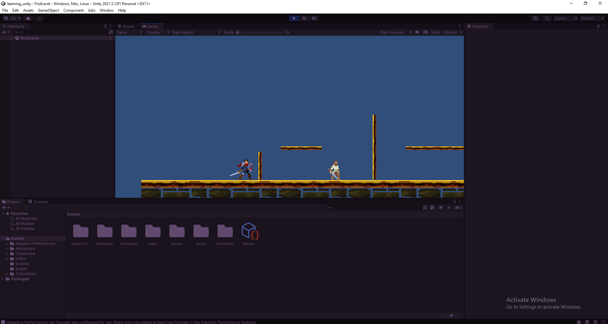
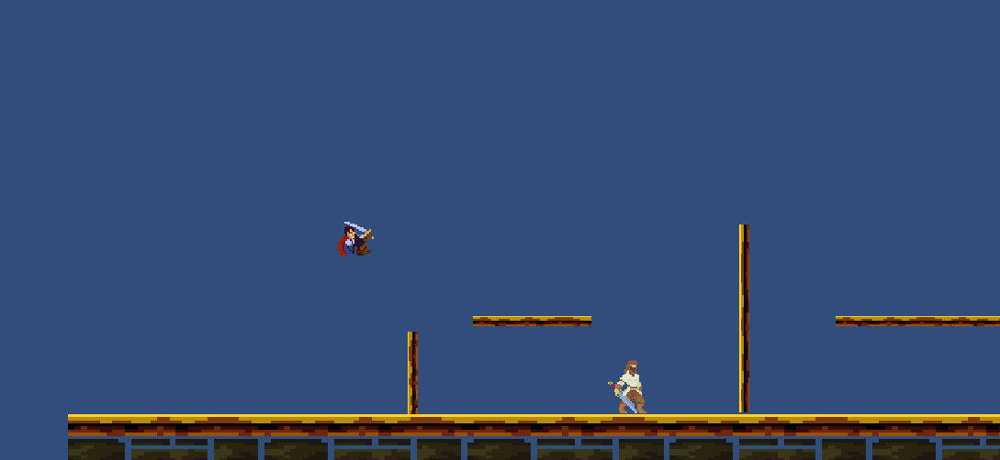
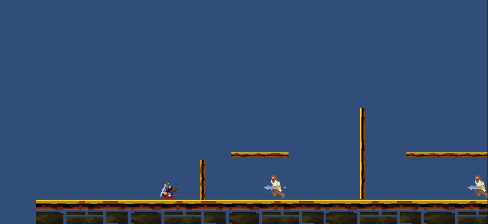

# Learning Unity

It is a simple game project I am building in order to learn unity.

It is a 2d pixel side view platformer game that I am trying to create.

### Some features I am working on

- Different levels
- Health bar display
- Bandit character (enemy) able to attack player
- Main menu, Game over Screens
- Health Potions to refill some health
- Some sort of flying enemy to tackle

### Some Gameplay Screenshots
 

 
 

 
 

### Use of Assets

- Most of the assets including the players, environment, materials and animations are from the unity assets store.

[Hero Knight 2d Pixel asset by Sven Thole](https://assetstore.unity.com/packages/2d/characters/hero-knight-pixel-art-165188)

[Bandit 2d Pixel asset by sven Thole](https://assetstore.unity.com/packages/2d/characters/bandits-pixel-art-104130)

[Sven Thole unity asset portfolio](https://assetstore.unity.com/publishers/31468)

### Use of Code

- Code for the characters are from [Sven Thole](https://assetstore.unity.com/publishers/31468) asset package modified to my needs.
- Some of the code usages are from the [freecode camp unity course video by Fahir from Awesome Tuts](https://www.youtube.com/watch?v=gB1F9G0JXOo&t=7440s)